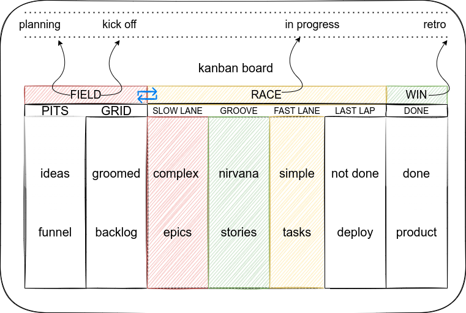

# RACE:XP Methodology

- **R**ealistic **A**gile **C**oncepts for **EX**treme **P**rogramming

uses the `race [car|team] metaphor` as the ontology of rapid prototyping/product development

- ontology

  - a set of concepts and categories in a subject area or domain that shows their properties and the relations between them.
  - the philosophical study of being in general, or of what applies neutrally to everything that is real. It was called “first philosophy” by Aristotle in Book IV of his Metaphysics.

- ~one day I'll publish this~
- for now: the below should suffice
  - Realistic: ...
  - [Agile](https://www.metaltoad.com/blog/most-agile-thing-you-can-do-throw-away-agile): ...
  - [Concepts](https://en.wikipedia.org/wiki/Extreme_programming#Concept): ...
  - [Extreme Programming](https://www.amazon.com/Extreme-Programming-Explained-Embrace-Change/dp/0321278658)

[THE FIELD](https://en.wikipedia.org/wiki/Glossary_of_motorsport_terms)

- The competing cars in an event.
  - `the pits` + `the grid`
  - all the tickets that could potentially be worked on

[THE PITS](https://en.wikipedia.org/wiki/Pit_stop)

- In motorsports, a pit stop is a pause for refueling, new tires, repairs, mechanical adjustments, a driver change, as a penalty, or any combination of the above. These stops occur in an area called the pits, most commonly accessed via a pit lane which runs parallel to the start/finish straightaway of the track
  - tickets that require business + engineering attention

[THE GRID](https://en.wikipedia.org/wiki/Glossary_of_motorsport_terms)

- The starting formation of a race, generally in rows of two for cars and three or four for bikes. The Indianapolis 500 traditionally has a unique grid of three cars per row.
  - tickets ready to be developed

THE RACE

- I like to use 4 in progress tracks (see `THE GROOVE` below)
- depending on the drivers part of your team, and each developers capabilities, will determine the set of in progress tickets and how they are categorized in the 4 in progress tracks

  - e.g. a junior devs GROOVE is far different than a senior devs GROOVE
    - [you want to keep all of your engineers in their GROOVE](https://computus.org/7-tips-for-programming-in-the-zone/)

- The optimal path around the track for the lowest lap time. In drag racing it is about the center portion of the lane, where the cars can gain traction quicker.
  - `SLOW lane` too many of these and your drivers wont be happy, forecasts wont be accurate, and the _fast_ lane will be over utilized to compensate for poor finishes
  - `THE GROOVE` [the optimal ticket](https://en.wikipedia.org/wiki/Glossary_of_motorsport_terms): your team is successful, drivers are winners, races are predictable
  - `FAST lane` too many of these means all your trophies are gold plated, but hey - you can fill your team with cheap engineers and junior devs
  - `THE LAST LAP` if our users arent using it then its not providing utility, and usually not useful to consider the ticket done, so use the last lap for this usecase
    - there are a lot of stats and insights to glean from plotting tickets on these 4 dimensions over time...
  - `DEPLOYED`: refrain from the use of `DONE` status, DONE doesnt exist in the real world; this also supports the adoption of `refactoring as a lifestyle`

[RACING FLAGS](https://en.wikipedia.org/wiki/Racing_flags)

- the dimensions on which a ticket is evaluated to ascertain quality:

  - basically anything you want, but all should be:
    - technical principals/best practices, e.g. DRY, SOLID, KISS, efficiency, effectiveness, etc.
    - not solvable by automation: keep your biases/opinions to a minimum and the team focused on finishing the race successfully, not perfectly

- [MEATBALL](https://en.wikipedia.org/wiki/Racing_flags#Black_flag)

  - A mechanical black flag is a black flag with an orange disc in its center which indicates that a vehicle is being summoned to the pits due to serious mechanical problems or loose bodywork that presents a risk to other competitors. At some road racing events, it is used to summon the vehicle to the pits to inform the driver of violation "maximum sound levels.” Also known as the 'Meatball' flag.
  - only `meatballs` are rejected/reworked, everything else is pushed through (fk your opinions: the team has a race to win; if its not a _meatball_, it must be **steak**)

- [YELLOW FLAG](https://en.wikipedia.org/wiki/Racing_flags#Yellow_flag)

  - The solid yellow flag, or caution flag, universally requires drivers to slow down due to a hazard on the track, typically an accident, a stopped car, debris or light rain. However, the **procedures for displaying the yellow flag vary for different racing styles and sanctioning bodies**.
  - _too many_ yellow flags and a ticket could be labeled a meatball
  - _too few_ yellow flags is indicative of over optimizing (dont over optimize, be overly optimistic)
    - the idea being all tech is techdebt eventually, there is no perfectly groomed/scoped ticket. eventually all work will be redone
    - this idea should be built into your strategic planning and accepted as a first principle

- [CHEQUERED FLAG](https://en.wikipedia.org/wiki/Racing_flags#The_chequered_flag)

  - The chequered flag (or checkered flag) is displayed at the start/finish line to indicate that the race is officially finished. At some circuits, the first flag point will display a repeat chequered flag (usually on the opposite side of the circuit). The flag is commonly associated with the winner of a race, as they are the first driver to "take" (in other words, drive past) the chequered flag.
  - Upon seeing the chequered flag and crossing the finish line, drivers are required to slow to a safe speed, and return to their garage, parc fermé, or paddock, depending on the applicable regulations of the series.
  - Useful for keeping track of [all the factors](https://www.nature.com/articles/s41467-021-25477-8) that were in alignment for a particular ticket, developer, PM, etc that joined together and executed fkn flawlessly.
    - you should ask yourself right now: Do you know the specific levers to pull in order to push your team across the finish line... and if you have the data to back that shit up
    - and if not, you should atleast be keeping track of the tickets that represent the flawless fatality: apply the chequered flag

- [ADR-TYPE](https://adr.github.io/)

  - for tracking architectural decision records of a particular type
  - architecture is key to turning tech-debt into tech-features
  - TODO

- complexity of [scale and scope](https://econproph.com/2019/05/20/scale-and-scope/)

  - complexity of implementation (i.e. normal story points)
    - just because a ticket has a high story point, doesnt mean it takes a long time to complete
  - complexiity of completion (a time dimension)
    - just because a ticket takes a long time to complete, doesnt mean its developmentally complex
  - complex solutions dont always require complex deployments, and straight forward requirements can be a pain in the ass
  - understanding the scale and scope of product reqiurements, and the scale and scope to which a developed product satisfies a customers needs, provides the two unanswerable questions in development: how difficult is this to build, and how long will it take to build it

- the RACE

  - each lane (slow, groove, fast, last lap) is the sum of implementation & completion complexity based on an individual/teams capabilities

- [Scrum](https://www.atlassian.com/agile/kanban/kanban-vs-scrum) Ceremonies

  - sprint planning
  - daily scrum
  - sprint review
  - retrospective

- sprints in general

  - there is no sprint, or artificial deadline every X hours, we are in a race to build the best product, and each team goes in a circle: the grid > the race > the win: just like a formula 1 race team
    - the team should know when its time for retrospective, when its time to stop and plan, and when its time to race
    - the ideal solution being:
      - when any one developer has finished a race, only a subset of their team needs to ascertain the quality of the finish and support the driver in question to prepare for their next race
        - should cycle between drivers in an `on call queue` for everyone to keep a smaller, yet more focused scope of what every other driver is doing
      - other drivers can keep their `fk u` hat on and continue to focus on the issue at hand

- RACE:XP Ceremonies

  - TODO

- RACE:XP [Simulations](https://www.youtube.com/watch?v=suXyQKnhs8Q)

  - the ideal tool would be recurisve and rollup
    - each individual developer should have a board to track their race
    - each team should have a board (that rolls up individual races)
    - each prod org should have a kanban board (that rolls up team races)
    - each business unit... etc
  - Exactly what it sounds likes, the concrete understanding that all of our planning is merely an attempt to triangulate the ideal path towards a future state of being
  - a differnet kind of kanban, if you could call it kanban at all
    - maybe i'll be build it...
    - Formula 1 simulators are tools used to develop drivers, improving technique, and improving the car
    - RACE:XP simulators are tools used to develop engineers, improving engineering team capabilities, and improve our ability to produce products that meet requirements

- [Lean Software Development](https://en.wikipedia.org/wiki/Lean_software_development#Lean_software_practices)
- RACE Development
  - TODO

Inspiration behind RACE:XP

- the legend: Claude Rouelle
- 

## CTA - call-to-actions; [biz] Context-Technoloy-Asides

- the premier way to capture Use case Specifications, user requirements & acceptance criteria for RACEXP
- context: the biz context; put on your CEO & forward-facing CTO hat
- tech: the tech context & implementation strategy; put on your inward-facing CTO & engineer hat
- asides: additional abbreviations support the biz & tech context
